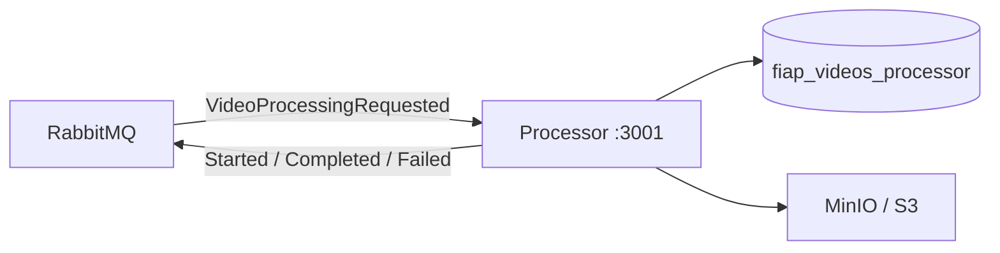

# app-fiap-videos-processor

Async worker service: consumes `VideoProcessingRequested`, extracts video frames with ffmpeg, builds a zip, and publishes result events.

## Responsibilities

- Consume `VideoProcessingRequested` from RabbitMQ
- Extract one frame per second with ffmpeg, pack into zip
- Publish `VideoProcessingStarted`, `VideoProcessingCompleted`, or `VideoProcessingFailed`
- Idempotent processing (skips already-completed jobs)

## Architecture

### Role in the platform

The processor is an **async worker** — no public business API. It consumes `VideoProcessingRequested`, runs ffmpeg frame extraction, builds a zip, and publishes lifecycle events back to the bus.



### Processing flow

1. `VideoProcessingRequested` arrives on queue `fiap-videos.processor.VideoProcessingRequested`.
2. Inbox deduplication; skip if job already `completed`.
3. Upsert `processing_jobs`, publish `VideoProcessingStarted` (via outbox).
4. Download video from `videos/{jobId}-{file}`, extract one frame per second with ffmpeg.
5. Pack frames into zip at `zips/{jobId}.zip`, upload to object storage.
6. Publish `VideoProcessingCompleted` or `VideoProcessingFailed` (via outbox).

### Hexagonal layout

```
src/
├── core/
│   ├── domain/          # ProcessingJob entity, ports, VideoFrameExtractor
│   └── application/     # ProcessVideoJobUseCase
└── adapter/
    └── infra/           # Drizzle, RabbitMQ, ffmpeg, S3/MinIO, outbox relay, health/metrics
```

Wiring: `src/adapter/infra/http/composition-root.ts`.

### Database (`fiap_videos_processor`)

| Table | Purpose |
|-------|---------|
| `processing_jobs` | Local job state mirror (idempotent re-processing) |
| `outbox` / `outbox_dead_letters` | Reliable event publishing |
| `processed_events` | Inbox deduplication |

### Messaging

Exchange: `fiap-videos.events` (topic). Queue pattern: `fiap-videos.processor.{eventType}`.

| Direction | Event |
|-----------|-------|
| Consumes | `VideoProcessingRequested` |
| Publishes (outbox) | `VideoProcessingStarted`, `VideoProcessingCompleted`, `VideoProcessingFailed` |

Prefetch is configurable via `CONSUMER_PREFETCH`. Failed messages go to per-queue DLQs.

### Dependencies

| Dependency | Usage |
|------------|-------|
| PostgreSQL | Job state and outbox |
| RabbitMQ | Event bus |
| MinIO / S3 | Read `videos/…`, write `zips/…` |
| ffmpeg | Frame extraction (bundled in Docker image) |

## Run locally

### Full stack

```bash
cd ../app-fiap-videos-infra/docker
docker compose up --build
```

### This service only

```bash
docker compose up --build
```

Starts processor + Postgres (`:5432`).  
**Note:** isolated mode does not receive uploads unless events are published to the shared broker and videos exist in storage.

### Development server (`yarn start:dev`)

**1. Start infrastructure** (shared Postgres, RabbitMQ, MinIO):

```bash
cd ../app-fiap-videos-infra/docker
docker compose up postgres rabbitmq minio minio-init -d
```

Or processor-only Postgres + shared RabbitMQ + MinIO:

```bash
cd ../app-fiap-videos-infra/docker && docker compose up rabbitmq minio minio-init -d
cd ../app-fiap-videos-processor && docker compose up postgres -d
```

**2. Configure & run:**

```bash
cp .env.example .env
yarn install
yarn db:migrate
yarn start:dev
```

Processor listens on http://localhost:3001 (health/metrics only).

Ensure `.env` uses `localhost:5432` for Postgres, `5673` for RabbitMQ, and MinIO at `http://localhost:9000` (see `.env.example`).

`yarn start:dev` runs `prestart:dev`, which starts this service's Postgres container (`fiap_videos_processor` is created automatically on first boot).

## HTTP (operations)

| Route | Purpose |
|-------|---------|
| `/health/live`, `/health/ready` | Probes |
| `/metrics` | Prometheus |
| `/api/docs` | Ops Swagger |

## Messaging

| Direction | Events |
|-----------|--------|
| Consumes | `VideoProcessingRequested` |
| Publishes | `VideoProcessingStarted`, `VideoProcessingCompleted`, `VideoProcessingFailed` |

Uses transactional **outbox** for publishes and **inbox** for idempotent consumption.

## Environment

See [`.env.example`](./.env.example). Key vars: `DATABASE_URL`, `RABBITMQ_URL`, `STORAGE_BACKEND`, `S3_BUCKET`, `S3_ENDPOINT`, `FFMPEG_PATH`, `CONSUMER_PREFETCH`.

## Tests & CI

```bash
yarn lint:ci
yarn typecheck
yarn test:unit
yarn test:cov
yarn build
```

Integration tests run against a real PostgreSQL database:

```bash
yarn test:integration                 # needs DATABASE_URL (or a Postgres on localhost:5433)
bash scripts/run-integration-tests.sh # spins up a throwaway Postgres container automatically
```

GitHub Actions runs `build`, `lint`, `type-check`, `test-unit`, `test-integration`, `security-audit`, and a `ci-success` gate on every push and pull request to `main`.

## Infrastructure

Local Docker Compose, Prometheus, Grafana, and Kubernetes manifests live in [`app-fiap-videos-infra`](../app-fiap-videos-infra).

## Docker

Image includes **ffmpeg**. Videos and zips are stored in MinIO locally (`STORAGE_BACKEND=minio`) or AWS S3 in production.
